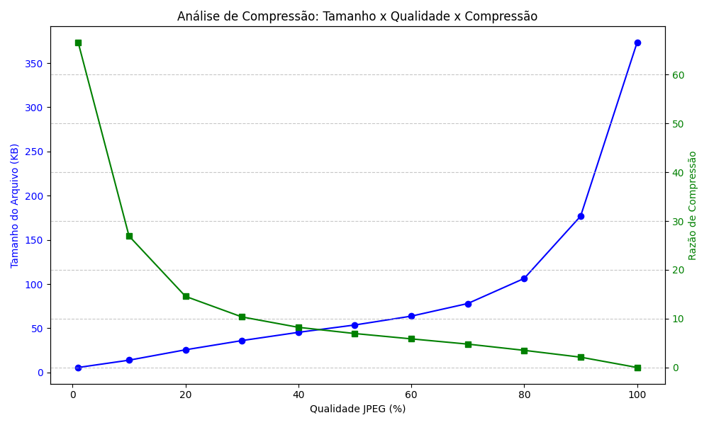

# Teoria da Informação: Compressão e Criptografia

## Tarefa

- Pesquisar e resumir os conceitos de compressão com perda de informação e como ela difere da compressão sem perda informação.
- Analisar os conceitos de redundância e irrelevância perceptual, explicando como eles influenciam a codificação com perda.
- Explicar o funcionamento básico do algoritmo de compressão com perda JPEG.

Requisitos para a Entrega:

- Relatório com no mínimo 3 páginas, estruturado conforme descrito.
- Anexar as tabelas e gráficos que mostram a relação entre compressão e qualidade.
- Entregar o relatório em PDF.

Critérios de Avaliação:

- Clareza e coesão do relatório.
- Profundidade da análise teórica e discussão dos resultados.
- Qualidade da documentação.

## Desenvolvido por

- Gabriel de Freitas

## Executar

- Tenha o `python==3` e `matplotlib==3.9.2` instalados
- Execute o arquivo `main.py`

## Pesquisa

## Resultado

